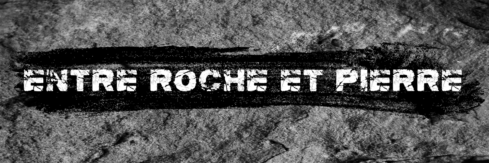
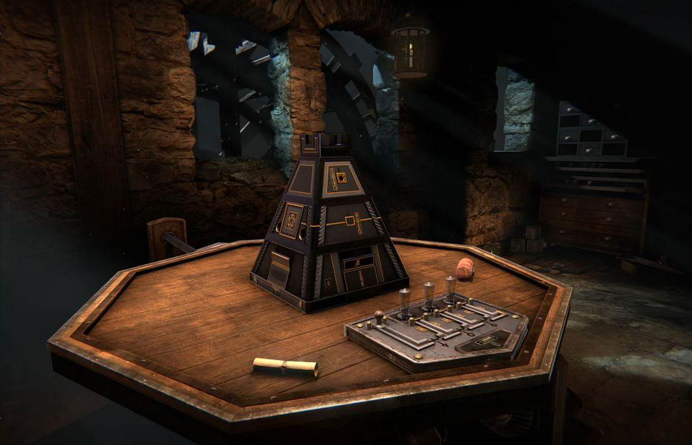
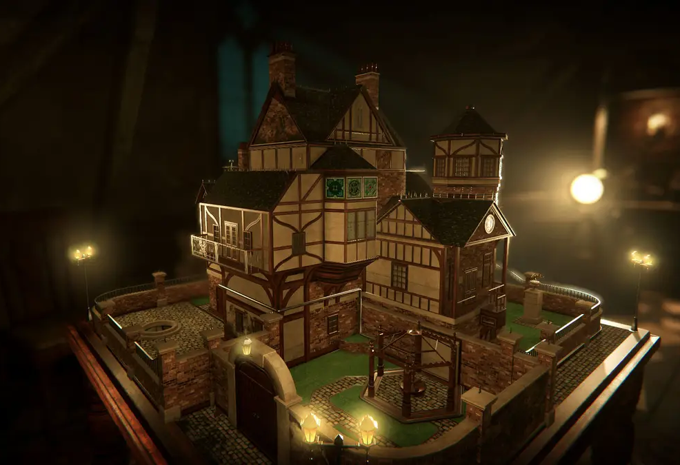
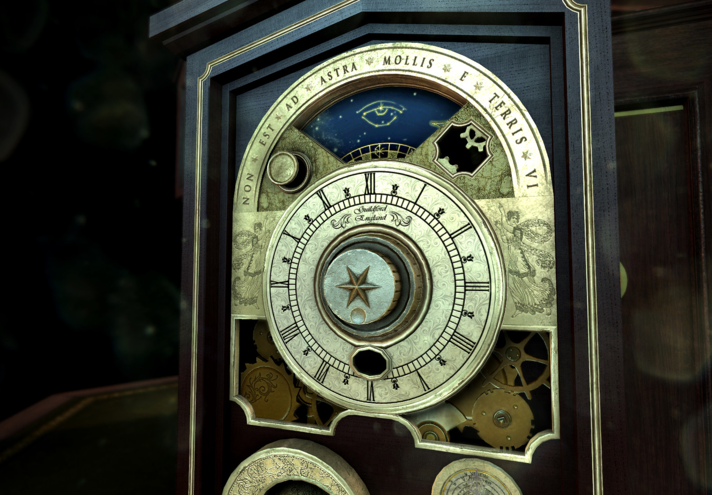
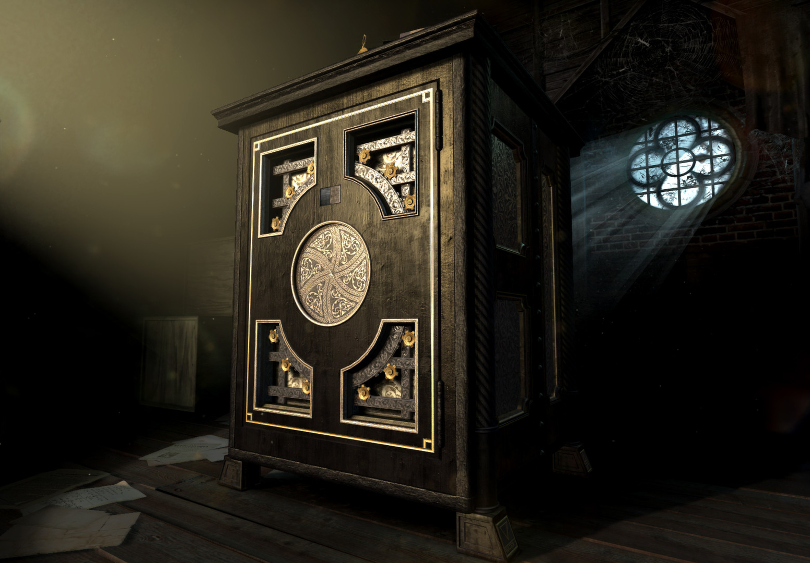

</img>

Un jeu de casse tête thématique qui se concentre sur des "Puzzle boxes" afin de s'échapper.

## Description

Entre roche et pierre est un jeu de casse tête où le joueur résout des casse-tête sur des "Puzzle boxes" afin d'obtenir certains objets qui lui permettront de s'échapper du château où il se trouve. Le jeu se jouera principalement de façon linéaire, cependant il serra possible d'obtenir certains objets et de ne pas avoir à les utiliser immédiatement. Deux boîtes se trouveront sur des tables dans la pièce. La deuxième boite ne va pas être utilisable avant d'avoir atteint un certain point avec la première boîte. Et un puits servira également à obtenir un objet nécessaire aux casse têtes.

## Moodboard
### Gameplay
</img> </img> </img> </img>
